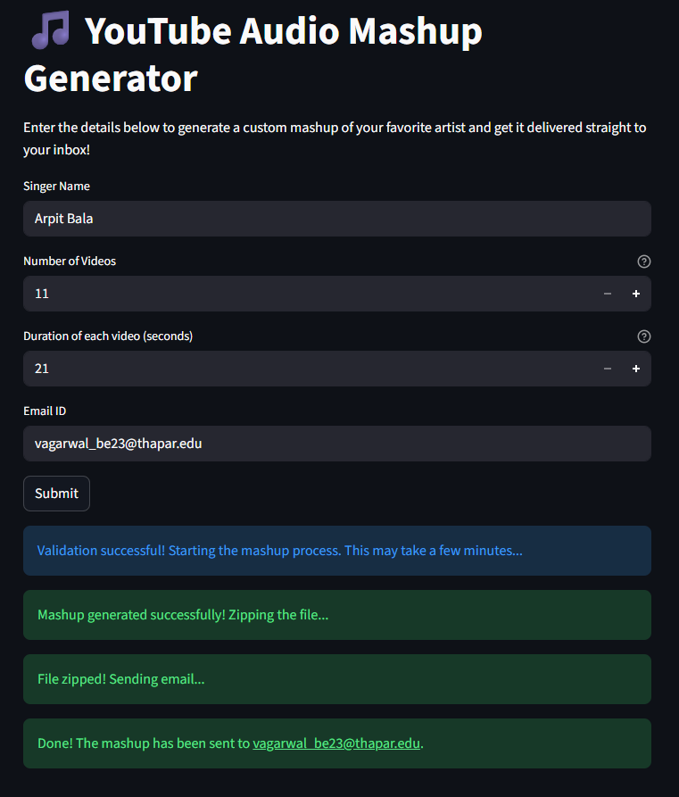

# YouTube Audio Mashup Generator 🎵

**Author:** Vihaan Agarwal
**Roll Number:** 102303658

## 📸 App Preview


## 🌐 Live Web App
**https://mashup102303658.streamlit.app/**

## 📜 Description
This project is a Python-based command-line tool and web service that downloads audio from YouTube, trims it, and merges it into a single mashup file. 

## ⚙️ How to Run Locally (Command Line)
1. Install dependencies: `pip install -r requirements.txt`
2. Ensure `ffmpeg` is installed on your system.
3. Run the script:
   ```bash

   python 102303658.py <SingerName> <NumberOfVideos> <AudioDuration> <OutputFileName>
